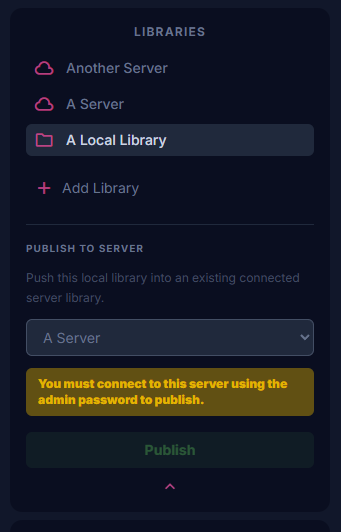
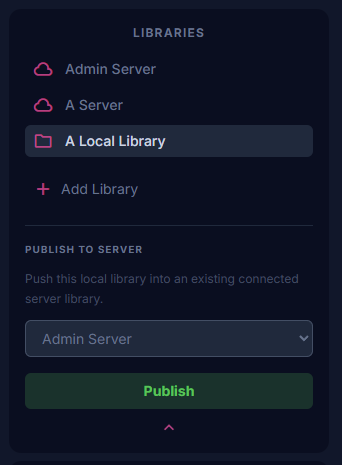
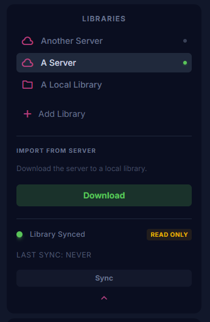

# Athena Server
The official Go-based self-hosted backend for the Athena app.
This is an optional part of Athena that allows for self-hosted libraries.
Athena servers will provide the following if used:

## Features
* **No Accounts Needed:** No account registration or login is required to a centralized server. All that's needed to access a server is the IP and the password.
* **User Authentication:** Lock down access to your libraries with server-specific credentials.
* **Multi-Device Syncing:** Seamlessly access and push changes to your libraries across an unlimited number of devices.
* **Library Sharing:** Grant access to your libraries so trusted friends or team members can view or collaborate.

---
## Quick Start (Docker Compose)

The easiest and recommended way to deploy the Athena Server is via Docker.
Before proceeding, make sure that Docker is installed and you have a general idea of how to use it.

Create a `docker-compose.yml` file on your server and paste the following configuration:
```yaml
services:
  athena:
    image: ghcr.io/athenaeum-app/athena-server:latest
    # Container name is used to identify the service in Docker commands.
    # You can change this to any name you like, but must not conflict with any other container names.
    container_name: athena-server
    restart: unless-stopped
    ports:
      # Only change if you know what you are doing!
      # The right port should always remain as 8080.
      # But the left port can be changed to any available port on your server.
      - "8080:8080"
    environment:
      # ADMIN_PASSWORD grants full mutate/publish access. Make this strong and unique!
      - ADMIN_PASSWORD=admin 
      
      # PASSWORD acts as the standard/viewer login. Keep this different from the Admin password.
      # Logging in via this password will only grant view-only permissions.
      - PASSWORD=password 
      
      # MAX_UPLOAD_MB limits the file size for attachments. This is in MB
      - MAX_UPLOAD_MB=50

      # BACKUP_INTERVAL sets how often the server automatically creates a backup. 
      # Valid time units are "h" (hours) or "m" (minutes). Leave blank or remove to disable automated backups.
      - BACKUP_INTERVAL=2h

      # BACKUP_RETENTION is how many backup files to keep on disk before automatically deleting the oldest ones.
      # Defaults to 7 if not specified.
      - BACKUP_RETENTION=12
    volumes:
      # Only change if you know what you are doing!
      - ./athena-data:/app/data
```

Once your file is saved, start the server in the background by running:

```bash
docker-compose up -d
```

To receive updates, simply turn off the server and pull the latest image:

```bash
docker-compose down
docker-compose pull
docker-compose up -d
```

---
## Configuration Guide

The server behavior is controlled entirely through environment variables. Be sure to update the defaults before exposing your server to the internet.

| Variable | Default | Description |
| --- | --- | --- |
| `ADMIN_PASSWORD` | `admin` | The master password used to authenticate as an admin. Required to publish libraries, mutate data, and manage settings. |
| `PASSWORD` | `password` | The standard viewer/collaborator password. Give this to people you want to share your library with. |
| `MAX_UPLOAD_MB` | `50` | The maximum file size (in Megabytes) allowed for media/file uploads. |
| `BACKUP_INTERVAL` | `2h` | Sets how often the server automatically creates a database backup (e.g., `2h` or `30m`). Leave blank to disable automated backups. |
| `BACKUP_RETENTION` | `7` | The maximum number of backup files to keep on disk before automatically deleting the oldest ones. |

---

## Migration
Data can be migrated **to and from** a server at any time. If you already have a local library, you can upload all the data to your server using the publish on the library selector. This will override the existing data on the server. Vice versa, you can download all the data from your server to a new local libary using the download option on the library selector.
- To see the publish button, you must have the local library you wish to publish selected.
- To see the download button, you must have the library you wish to download selected.

| Context | With no admin access | With admin access |
| --- | --- | --- |
| Publish (Only if admin access is granted via admin password) |  |  |
| Download (No admin access required) |  |  |


## Data Persistence
By default, the `docker-compose.yml` binds a local folder (`./athena-data`) to the container's internal `/app/data` directory.

This ensures that your SQLite database, uploaded media, and configuration files remain safe and persistent even if the Docker container is restarted, updated, or destroyed. **Make sure to back up this folder regularly!**

Please test persistence first before fully creating entries.

## Backups
Automatic backups of the SQL database are available and configurable via the environment variables `BACKUP_INTERVAL` and `BACKUP_RETENTION`.
If backups are enabled, the server will generate a new backup file at the specified interval and keep the specified number of backups, deleting old ones as needed. To restore a backup:

* Stop the server (`docker-compose down`).
* Select the backup file you want to restore (`athenaeum_YEAR-MONTH-DAY-TIME.db`).
* Replace `athenaeum.db` located in the data directory (default is `./athena-data`) with the selected backup file. Make sure that the backup is renamed to `athenaeum.db`.
* Restart the server using `docker-compose up -d`.
* Verify that the backup has been restored successfully.
